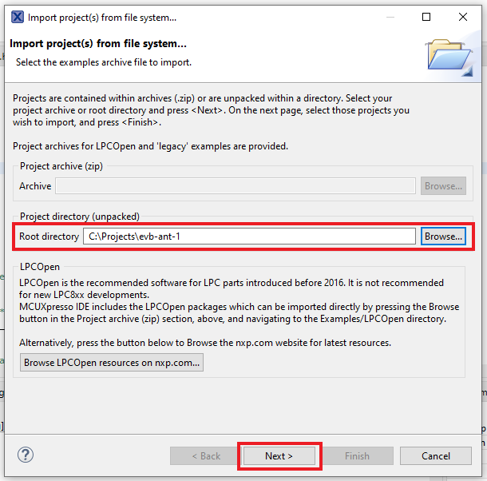
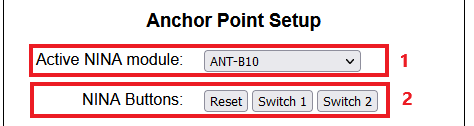

# EVB-ANT-1
**EVB-ANT-1** is the application board for the Bluetooth Indoor Positioning kit from u-blox: [XPLR-AOA-3](https://www.u-blox.com/en/product/xplr-aoa-3-kit).
The board itself is directly connected to the antenna board [ANT-B10](https://www.u-blox.com/en/product/ant-b10-antenna-board).
A detailed description of the hardware and its capabilities and components can be found here: [XPLR-AOA-3-UserGuide](http://www.u-blox.com/docs/UBX-22006906).

The basic purpose of EVB-ANT-1 is to provide connectivity for the angle measurements data created by the antenna board. 

### EVB-ANT-1 Firmware
This open-source project is a basic firmware written for the MCU of EVB-ANT-1, which is an NXP RT1062. 
The firmware includes the main functionality and features for evaluating the antenna boards and setting up an indoor positioning system by using a position engine.
The main software features are the following:
- Multithreaded implementation using freeRTOS
- Ethernet connectivity
- WiFi connectivity 
- UART communication with the NINA-B4 module that runs the angle of arrival calculations
- UDP client for connecting to the positioning engine 
- Flash memory storing and reading for configuration data (protected by CRC-check)
- HTTP server 
- Web page with form for setting and reading configuration, as well as some controls

### Downloading the code
- Clone the repository

### Seting up the environment (MCUXpresso)
- Register to MCUXpresso website: http://www.nxp.com/mcuxpresso/ide
- Download MCUXpresso IDE (v11.6.0 or later)
- Open MCUXpresso IDE
- In the welcome page select "Download and install SDKs"
- Find board evkmimxrt1060, select it and press "Install"

### Building using MCUXpresso IDE
- Open MCUXpresso IDE

- Inside Quickstart Panel select "Import project(s) from file system..."

 
- On "Root Directory" select "ax_app_project_buildup" folder and press "next" and then "Finish"

- To build the code, go to "Project" and select "Build Project"

### Debugging using MCUXpresso IDE
Required Hardware:
EVB-ANT-1, segger j-link, 9-Pin Cortex-M Adapter

- Set the dip switches on the evb to: 0-0-1-0

- Connect the segger j-link to the EVB-ANT-1 J8 (MCU JTAG) connector, using 9-Pin Cortex Adapter.

- On the 'Workspace' view, right click on the project name
- Go to "Debug as"
- Select "SEGGER J-Link probes"

### Flashing through UART
The MCU has a bootloader that makes it possible to flash the firmware using its UART. The UART is driven to a usb-to-serial converter. So, it can be connected to a PC using a USB cable and it will appear as a virtual COM port.
To Flash the firmware image, NXP MCUBootUtility tool is needed.

The firmware image can be found inside the project's 'Debug' folder with the name <project_name>.axf.
This file is generated by the IDE once you build the project with the 'Debug' configuration

- Download the third party tool MCUBootUtility from the following repository:
https://github.com/JayHeng/NXP-MCUBootUtility
- Build project and obtain .axf file, or use the pre-built .axf file for the release (GitHub releases section)
- Set the dip switches on the evb to: 0-0-0-1 and then restart the MCU. 
This will make it enter in bootloader mode and expect a new image from the UART port.

- Connect evb to PC by using only a USB cable to the FTDI port (J13)
- Run the .exe file from the 'bin' folder of the NXP-MCUBootUtility repo
- Target setup: MXRT106x(-LFBGA196) with FLEXSPI NOR

- Port setup: the first COM number from the 4 enumerated virtual ports, Baud rate 115200
- Check 'one step' and press 'connect to ROM'

- Load the .axf file and press the 'All-in-one Action' button

The image should be flashed to the MCU

When flashing is complete, the user needs to bring the dip switches back to the position 0-0-1-0 and restart the MCU.
This way the MCU will re-enter the normal operation mode

## Configuring EVB-ANT-1
Out of the box, EVB-ANT-1 is preconfigured to use the ethernet interface with IP address 192.168.1.102 and subnet mask 255.255.255.0.
The user can connect it to a router or directly to a pc afer configuring its network interface to the same subnet. 
Then by using a browser to view "http://192.168.1.102/", the user can configure all connectivity details for the device.

### Wifi Setup

 In the wifi setup section there are the fields:
 - "Enabled" checkbox [1], that enables or disables the whole wifi interface.
 - "SSID" and "Password" [2] that define the preferable wifi network in which the EVB-ANT-1 will try to connect after rebooting.
 - "IP", "Subnet mask", "Default Gateway", "DNS Server 1", "DNS Server 2" [3], that define the configuration of the interface
 - "DHCP checkbox" [4], for enabling dynamic ip allocation
 - "RSSI" [5], that shows the signal of the network we are connected to, if any. 
 Note that if DHCP is enabled, the above fields will be populated with the valid info
 
### Ethernet Setup

Respectively, in the ethernet setup section there are the fields:
 - "Enabled" checkbox [1], that enables or disables the ethernet interface.
 - "IP", "Subnet mask", "Default Gateway", "DNS Server 1", "DNS Server 2" [2], that define the configuration of the interface
 - "DHCP checkbox" [3], for dynamic ip alocation.
 Similarly to the WiFi section, the above fields also get the actual values in case of enabled DHCP

### Positioning Engine Setup

In the positioning engine setup section, it is possible to set the parameters for the communication betwween EVB-ANT-1 and the positioning engine, using the fields
 - "IP / Hostname" [1], set the IP or host name of the positioning engine.
 - "Port" [2], set the destination port for sending the UDP packets with the angle measurements.

### Anchor point Setup

In the anchor point setup section, there are:
 - The "Active NINA module" dropdown menu [1]. In this selection we decide if we want to be using the NINA module of the ANT-B10 antenna board, or the secondary NINA module that is on the EVB board. The secondary NINA enables the user to experiment with different makes of antennas 
 - The three "NINA buttons" [2], that control the NINA modules. These button will apply the relative function directly on the selected NINA module upon pressing

### Applying / Viewing Configuration
 - 'Submit' button permanently saves the configuration to the device's memory
 - 'Read' button refreshes the form with the corresponding data from the device.

NOTE: Most of the connectivity related parameters will not apply immediately after submitting, but will require restarting the device

### Runtime info

At the end of the page, there is a realtime counter that continuously polls the MCU to get the time since last boot[1]. 
Also there is the "reboot" button [2] that applies a soft reset to EVB-ANT-1.

### Resetting Configuration

If the "SW1" button of EVB-ANT-1 is pressed and held down during booting, the configuration would be reset to the initial values. That means that the configuration page will be accessible in address "192.168.1.102" of ethernet interface.

### Web interface
The configuration page is written using HTML, CSS and JavaScript

The files are located in `UI` folder.

However, the http server that runs on the MCU needs to have them in a C array form.

For that purpose there is a script `python arrayify_web_pages.py` from the `UI/tools` which will replace the `source/app/bip_httpsrv_fs_data.c` with the updated UI.

Note: After updating the website files a hard refresh in the browser may be required to see latest changes.

### SDK Notes
For this project we used NXP SDK EVK-MIMXRT1060, version 2.12.1 ([NXP GitHub repository](https://github.com/nxp-mcuxpresso/mcux-sdk))

The following changes had to be made in SDK files:

lwip/port/enet_ethernetif.c:

Relevant discussion:
https://community.nxp.com/t5/MCUXpresso-SDK/MCU-stops-if-ethernet-cable-is-not-plugged-in-on-startup/m-p/1371744

lwip/port/enet_ethernetif_kinetis.c:

Relevant discussion:
https://community.nxp.com/t5/MCUXpresso-General/DTC-or-OC-SRAM/td-p/1302973

